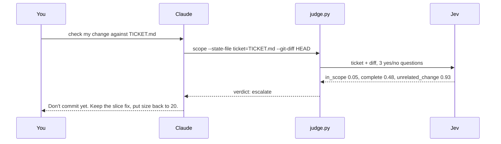

# Sensibility

Sensibility lets Claude Code ask [Jev](https://docs.typesafe.ai), TypeSafe's judgment model, short typed questions while it works. Is this true? Which of these fits best? Where does this sit on these levels? Jev answers with probabilities in about half a second, at roughly $0.00005 per question batch. Jev doesn't write text. It only answers the questions it's given.

The plugin has three parts.

The judge skill, `/sensibility:judge`, is for Claude to use on its own: ranking options, checking a diff against its ticket, checking a commit message against its diff, or scoring how clearly a PR description reads. It ships with three reusable question sets, called batteries: `scope`, `commit` and `clarity`.

The Risk gate is off by default. When it's on, it judges every Bash command before it runs. When a command is both risky and destructive, or risky and outside what you asked for, Claude Code stops and asks you:

```
Sensibility risk gate: risk 1.4/3, deletes or overwrites data, is outside what the user asked
```

Everything else runs as usual. With the gate on, each Bash call takes about 0.5 s longer. Force pushes, `DROP TABLE` and `rm -rf ~` get stopped, and a `git push` you asked for goes through.

The Finish gate is on by default. When Claude ends a turn short of what you asked (offering to do the work instead of doing it, asking permission you already gave, or stopping at a plan), Claude gets one nudge to keep going.

If there's no key, the network fails or Jev is slow, both gates let the command or reply through. They never block your work.

## Install

In Claude Code:

```
/plugin marketplace add rajnandan1/sensibility
/plugin install sensibility@sensibility
```

Or from a terminal:

```sh
claude plugin marketplace add rajnandan1/sensibility
claude plugin install sensibility@sensibility
```

From a local clone, run `claude plugin marketplace add /path/to/sensibility` and then the same `install` line. To try it for a single session without installing: `claude --plugin-dir /path/to/sensibility`.

You need `python3` on your PATH (3.9 or later, no packages). On macOS, `xcode-select --install` provides it. Tested on Claude Code 2.1.280.

## Set the key

1. Get a key at https://console.typesafe.ai/keys.
2. Export it in your shell, for example in `~/.zshenv`:

   ```sh
   export TYPESAFE_API_KEY=...
   ```

3. Restart Claude Code.

Without a key, the judge skill prints these steps and stops. The gates turn themselves off and show one message per session.

## Example: catch a change the ticket didn't ask for

The ticket says: *page 2 repeats the last item of page 1. Fix the slice. Nothing else is broken.* The diff fixes the slice, but it also changes `total_pages(count, size=20)` to `size=25`.

You ask Claude: *"Before I commit, use the sensibility judge to check my change against TICKET.md."*



| Question | Answer | With `size=20` restored |
| --- | --- | --- |
| Is every change something the ticket asks for? | 0.05 | 0.97 |
| Does the diff do everything the ticket asks? | 0.48 | 0.96 |
| Is there an unrelated change? | 0.93 | 0.03 |
| Verdict | `escalate` | `act` |

The whole check took about half a second, and Claude never had to paste the diff into its own context. These numbers come from a real run; repeat runs moved them by a few hundredths and gave the same verdict every time.

## Turn the gates on or off

From a terminal (this works whether or not the plugin is already installed):

```sh
claude plugin install sensibility@sensibility --config bash_gate=true    # Risk gate on
claude plugin install sensibility@sensibility --config bash_gate=false   # Risk gate off
claude plugin install sensibility@sensibility --config stop_gate=false   # Finish gate off
```

Or in Claude Code, run `/plugin configure sensibility@sensibility`, type `true` or `false` in each field, and choose Save configuration.

`stop_gate` controls the Finish gate (default `true`) and `bash_gate` controls the Risk gate (default `false`). Restart Claude Code after you change them.

In testing on 51 real turns, the Finish gate fired 3 times and was right about once. Each wrong nudge costs one extra model turn. Turn it off if the nudges get in your way. Turn the Risk gate on if you want a second check before destructive shell commands.

## Batteries

A battery is a JSON file with a set of questions and, optionally, a gate that turns the answers into `act`, `confirm` or `escalate`. To see every battery Claude can use, ask it to list the Sensibility batteries.

To change a built-in, copy its file from [`batteries/`](batteries/) and edit the copy. A copy in your project's `.claude/sensibility/batteries/` beats one in `~/.claude/sensibility/batteries/`, and both beat the plugin's own. [`skills/judge/reference.md`](skills/judge/reference.md) has the file format.

The two gate batteries, `risk` and `finish`, load only from `~/.claude/sensibility/batteries/` or the plugin, never from a project. A repo you clone can't loosen your Risk gate.

## What leaves your machine, and what gets logged

For each gate judgment, the plugin sends your last prompt plus the command or reply being judged to TypeSafe's API. If your prompts or commands must stay local, turn the gates off.

Each gate judgment is also appended to `judgments.jsonl` in the plugin's data directory under `~/.claude/plugins/data/`, with the state sent, the answers, the verdict and the latency. You can delete the file at any time. Judge skill calls are not logged.

## License

MIT. See [LICENSE](LICENSE).
