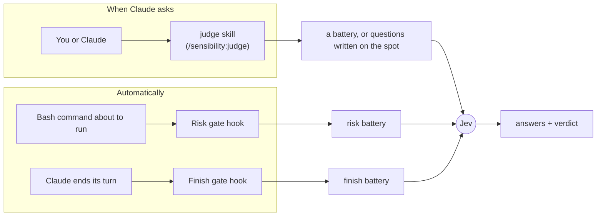
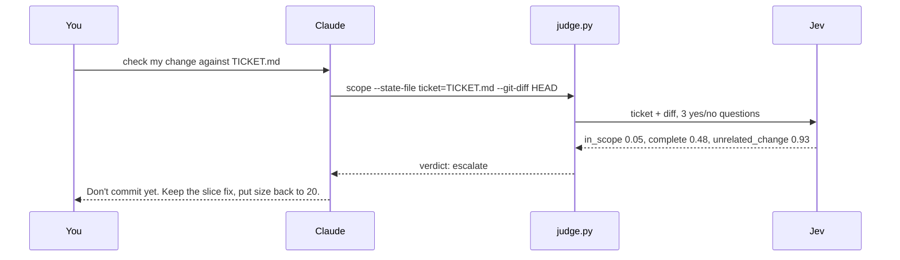

# Sensibility

Sensibility gives Claude Code a second opinion it can ask for in half a second.

Claude makes lots of small calls while it works: does this diff match the ticket, is this commit message honest, is this shell command safe to run, did I actually finish what was asked. Sensibility lets Claude hand those calls to [Jev](https://docs.typesafe.ai), a model from TypeSafe that only answers questions. Jev doesn't write code or text. You give it some text and a few questions, and it returns a probability for each answer in about 0.5 s, for about $0.00005.

## Quick start

**1. Install the plugin.** In Claude Code:

```
/plugin marketplace add rajnandan1/sensibility
/plugin install sensibility@sensibility
```

**2. Add your TypeSafe key.** Get one at https://console.typesafe.ai/keys, then add this line to `~/.zshenv` (or your shell's startup file):

```sh
export TYPESAFE_API_KEY=your-key-here
```

**3. Restart Claude Code** so it picks up the key and the plugin.

**4. Try it.** In any git repo with uncommitted changes, paste this with your own ticket text:

```
Use the sensibility judge to check my uncommitted change against this ticket: <paste the ticket>
```

Claude runs one command and reports a verdict (`act`, `confirm` or `escalate`) with the numbers behind it. If something is off, it tells you what.

You also need `python3` 3.9 or later on your PATH. macOS has it after `xcode-select --install`. Tested on Claude Code 2.1.280.

## How it works

You only need four words:

- **Jev**: TypeSafe's judging model. It answers questions about some text. It never writes anything.
- **Question**: one thing you ask Jev. There are three kinds. A yes/no question returns the chance the answer is yes (0.93 means very likely). A pick-one question chooses from options you list. A score question places the text on levels you describe.
- **Battery**: a saved set of questions in a JSON file, reused by name. `scope`, for example, asks three questions about a diff and a ticket.
- **Gate**: rules inside a battery that turn Jev's answers into one verdict: `act` (go ahead), `confirm` (flag it, carry on) or `escalate` (stop and show you).

Sensibility uses them in two ways:



**The judge skill** runs when you or Claude ask for it. It can use any battery, or questions Claude writes on the spot.

**The two gates** are hooks. They run on their own, each with its own battery:

| Gate | Runs when | What it does | Default |
| --- | --- | --- | --- |
| Finish gate | Claude ends a turn | If Claude stopped short (offered to do the work instead of doing it, asked permission you already gave, ended on a plan), Claude gets one nudge to keep going. | **on** |
| Risk gate | Before every Bash command | If a command is risky and destructive, or risky and outside what you asked for, Claude Code stops and asks you first. | **off** |

**The battery skill** (`/sensibility:battery`) turns a rule of yours into a new battery and tests it before saving. See [Batteries](#batteries).

## Things to ask Claude

| You want to | Say something like | What runs |
| --- | --- | --- |
| Check a change against its ticket | "Use the sensibility judge to check my uncommitted change against TICKET.md" | `scope` battery |
| Check a commit message | "Use the sensibility judge to check my last commit message against its diff" | `commit` battery |
| Rate a PR or issue description | "Use the sensibility judge to score how clear this PR description is: ..." | `clarity` battery |
| Pick between options | "Use the sensibility judge to pick which of these three approaches best fits the ticket" | questions Claude writes on the spot |
| Save a rule as a check | "/sensibility:battery make a battery called log-line: a log message must name the operation that failed and the record it failed on, and must never include passwords, API keys, or personal data like emails" | the battery skill |
| See every battery | "List the sensibility batteries" | `judge.py --list` |

### Example: catching a change the ticket didn't ask for

The ticket says: *page 2 repeats the last item of page 1. Fix the slice. Nothing else is broken.* The diff fixes the slice, but it also changes `total_pages(count, size=20)` to `size=25`.



| Question | Answer | With `size=20` restored |
| --- | --- | --- |
| Is every change something the ticket asks for? | 0.05 | 0.97 |
| Does the diff do everything the ticket asks? | 0.48 | 0.96 |
| Is there an unrelated change? | 0.93 | 0.03 |
| Verdict | `escalate` | `act` |

The script read the ticket and ran `git diff` itself, so Claude got the verdict without loading the diff first. The numbers come from a real run; repeat runs moved them by a few hundredths and always gave the same verdict.

## Batteries

A battery is a check you can reuse. It's a small JSON file that holds a few questions for Jev and the rules that turn Jev's answers into a verdict. You write it once, give it a name, and from then on you (or Claude) can run it by that name on any text.

Five batteries come with the plugin:

| Battery | Checks | Used by |
| --- | --- | --- |
| `scope` | does a diff do what its ticket asked, and only that | judge skill |
| `commit` | does a commit message say what changed and why, and match its diff | judge skill |
| `clarity` | how clearly a PR or issue description reads (scores only, no verdict) | judge skill |
| `risk` | how irreversible and far-reaching a shell command is | Risk gate |
| `finish` | whether Claude's last reply stops short of what you asked | Finish gate |

Your own batteries go in `~/.claude/sensibility/batteries/` (every project) or `.claude/sensibility/batteries/` inside a repo (that repo only).

### Using a battery: a walkthrough

This walkthrough uses [`log-line.json`](examples/batteries/log-line.json), an example battery in this repo. It checks one rule: *a log message must name the operation that failed and the record it failed on, and must never include passwords, API keys, or personal data like emails.*

**1. Put the battery where Sensibility looks for it.**

```sh
mkdir -p ~/.claude/sensibility/batteries
curl -o ~/.claude/sensibility/batteries/log-line.json \
  https://raw.githubusercontent.com/rajnandan1/sensibility/main/examples/batteries/log-line.json
```

**2. Ask Claude to use it.** Say which battery and what to check:

```
Check the log lines in billing.py with the log-line battery.
```

`billing.py` has three log calls:

```python
log.error("charge card failed for order_id=%s: %s", order.id, err)
log.error(f"payment failed for {customer.email}")
log.error("something went wrong")
```

**3. Claude runs the battery once per log line.** Each run is one command that sends the line to Jev and takes about half a second:

```
judge.py log-line --state '{"message":"log.error(f\"payment failed for {customer.email}\")"}'
```

**4. Jev answers the four questions, and the battery's rules pick a verdict.** These are the real results:

| Log call | Names the operation | Names the record | Leaks a secret | Leaks personal data | Verdict |
| --- | --- | --- | --- | --- | --- |
| `charge card failed for order_id=%s` | 0.99 | 0.98 | 0.04 | 0.04 | `act` |
| `payment failed for {customer.email}` | 0.29 | 0.37 | 0.03 | 0.99 | `escalate` |
| `something went wrong` | 0.02 | 0.02 | 0.02 | 0.02 | `confirm` |

**5. Claude reports back.** In the real run it said two of the three lines needed fixing. The email line puts a customer's address in the logs and should log `customer_id` instead. "something went wrong" says neither which operation failed nor on which record. The first line is fine. It didn't edit the file until asked.

### What's inside a battery

Every battery has the same four parts. Here they are for `log-line.json`:

| Part | In `log-line.json` | What it's for |
| --- | --- | --- |
| `description` | "Does a failure log line name the operation and the record, without leaking secrets or personal data" | One line shown when you list batteries. |
| `state` | one key, `message` | What text the battery expects. Here, `message` holds the log line. `scope` expects two keys, `ticket` and `diff`. |
| `questions` | four yes/no questions: `names_operation`, `names_record`, `leaks_secret`, `leaks_pii` | What Jev is asked. Each one spells out what counts as yes and what counts as no, including the tricky cases: the word "password" in `password reset failed` is not a leak. |
| `gate` | leak score of 0.5 or more: `escalate`. Otherwise, a missing operation or record: `confirm`. Otherwise: `act`. | Turns the four scores into one verdict. Rules are checked in order and the first match wins. |

<details>
<summary>Show the full <code>log-line.json</code></summary>

```json
{
  "description": "Does a failure log line name the operation and the record, without leaking secrets or personal data",
  "state": { "description": "`message`: the log line or the logging call that produces it.", "keys": ["message"] },
  "questions": {
    "names_operation": {
      "type": "noul",
      "instructions": "Does `message` say which operation failed, as a specific action (charge card, send invoice, sync contact, write row to orders)?",
      "criteria": {
        "true": "A specific action is named: a verb plus what it acts on, or a clearly named function or job.",
        "false": "Only a generic phrase like 'error', 'something went wrong', 'failed', 'exception occurred', or 'request failed' with no specific action."
      }
    },
    "names_record": {
      "type": "noul",
      "instructions": "Does `message` identify the specific record the failure happened on, by an ID, key, or placeholder that will hold one (order_id=123, user {user_id}, invoice %s)?",
      "criteria": {
        "true": "Carries an identifier or a variable placeholder for one, pointing at a single record.",
        "false": "No identifier at all, only a record type ('an order', 'the user'), or only a count."
      }
    },
    "leaks_secret": {
      "type": "noul",
      "instructions": "Does `message` include, or interpolate a variable that holds, a password, API key, access token, secret, private key, or session cookie?",
      "criteria": {
        "true": "A credential value or a variable carrying one appears in the output (password=..., token {api_key}, Authorization header, full request headers).",
        "false": "No credential values. Mentioning the word 'password' or 'token' in prose ('password reset failed', 'token expired') without its value is fine."
      }
    },
    "leaks_pii": {
      "type": "noul",
      "instructions": "Does `message` include, or interpolate a variable that holds, personal data: an email address, phone number, full name, street address, date of birth, or government ID?",
      "criteria": {
        "true": "Personal data or a variable carrying it appears in the output (user.email, {phone}, 'jane@acme.com', customer name).",
        "false": "Only opaque identifiers (user_id=42, uuid), or the word 'email' used in prose ('send welcome email failed') without the address."
      }
    }
  },
  "gate": {
    "rules": [
      { "verdict": "escalate", "any": ["leaks_secret.noul >= 0.5", "leaks_pii.noul >= 0.5"] },
      { "verdict": "confirm", "any": ["names_operation.noul < 0.5", "names_record.noul < 0.5"] }
    ],
    "default": "act"
  }
}
```

</details>

### Making your own

You don't have to write the JSON. Describe the rule to the battery skill, and it builds the file for you:

```
/sensibility:battery make a battery called log-line: a log message must name the operation that failed and the record it failed on, and must never include passwords, API keys, or personal data like emails
```

The skill picks the question types, writes the file, then tests it. It makes up at least six example inputs (or uses yours), each with the verdict it should get, and runs every one twice. When an example gets the wrong verdict, it rewrites the questions and tests again. It finishes when every example comes out right, and shows you the results. Claude Code asks you once before it writes into `.claude/`.

`log-line.json` in this repo came out of exactly that prompt. The skill tested it on 8 lines, twice each, and all 16 runs gave the expected verdict. One test was `password reset email send failed for user_id=...`, which mentions a password and an email without leaking either; it passed.

To tune a battery later, edit its JSON or ask Claude to ("make log-line also flag phone numbers"). The battery skill retests it the same way.

### Making a battery run without asking

Claude only runs a battery when something tells it to. You have three options, from least to most automatic:

1. **Ask each time:** "check this with `log-line`".
2. **Add a line to your `CLAUDE.md`:** *"Before you commit, run the `log-line` battery on any log calls you added."* Claude then does it at that point on its own. This is enough for most rules.
3. **Write a hook** that calls `judge.py` on every matching event. Only worth it for a check that must never be skipped, since each run adds about 0.5 s.

### Changing a built-in

Copy its file from [`batteries/`](batteries/) into `~/.claude/sensibility/batteries/` and edit the copy. A copy in a project folder wins over your user copy, and both win over the plugin's own. The two gate batteries, `risk` and `finish`, only load from your user folder or the plugin, so a repo you clone can't change how your gates behave.

### More example batteries

<details>
<summary><code>comment.json</code>: keep a code comment only if it explains something the code can't</summary>

This battery asks one pick-one question, "what kind of comment is this?", and passes only the kinds worth keeping. [View the file](examples/batteries/comment.json).

| Comment | Jev's pick | Verdict |
| --- | --- | --- |
| `# increment the retry counter` | narration | `escalate` |
| `# changed from 3 to 5 after the outage last week` | history | `escalate` |
| `# IMPORTANT: do not remove, this is fine for now` | justification | `escalate` |
| `# Safari drops Content-Length on 304 replies, so read the size from the cached copy` | outside_constraint | `act` |
| `# RFC 9110 section 15.4.5: a 304 response has no body` | spec_link | `act` |
| `// eslint-disable-next-line no-console` | suppression | `act` |

</details>

<details>
<summary><code>pr-description.json</code>: plain prose that says what was broken and why the change fixes it</summary>

This battery asks three yes/no questions: does it use template headers, does it use buzzwords, does it explain why. [View the file](examples/batteries/pr-description.json).

| PR description | Template headers | Buzzwords | Explains why | Verdict |
| --- | --- | --- | --- | --- |
| `## Summary` / "introduces a robust enhancement" / `## Changes` / `## Testing` | 0.98 | 0.95 | 0.05 | `escalate` |
| "Updated jev.py to check the body of 403 responses. Added a blocked error." | 0.08 | 0.03 | 0.15 | `escalate` |
| "ok so the judge script treated every HTTP 403 as a missing key. Turns out the firewall also sends a 403 for some shell text…" | 0.04 | 0.03 | 0.89 | `act` |

</details>

All scores in this section come from real runs.

## Turn the gates on or off

From a terminal:

```sh
claude plugin install sensibility@sensibility --config bash_gate=true    # Risk gate on
claude plugin install sensibility@sensibility --config stop_gate=false   # Finish gate off
```

Use `=true` or `=false` with either name. The command works even when the plugin is already installed. Run `/reload-plugins` or restart Claude Code afterwards.

You can also run `/plugin configure sensibility@sensibility` inside Claude Code, type `true` or `false` in each field, and choose Save configuration.

## FAQ

<details>
<summary><b>How do I see my current settings?</b></summary>

Look for `sensibility@sensibility` under `pluginConfigs` in `~/.claude/settings.json`. If it isn't there, you're on the defaults: Finish gate on, Risk gate off. `claude plugin details sensibility@sensibility` lists what the plugin installs.

</details>

<details>
<summary><b>Do the gates use batteries?</b></summary>

Yes. The Risk gate uses the `risk` battery and the Finish gate uses `finish`. To change what a gate asks or when it steps in, copy its battery into `~/.claude/sensibility/batteries/` and edit it. Gate batteries never load from a project folder, so a repo you clone can't loosen your gates.

</details>

<details>
<summary><b>If batteries decide what a gate does, why are there on/off options?</b></summary>

A battery decides how a gate judges. The option decides whether it runs at all. When a gate is off, its hook exits straight away: no call to Jev, no delay, nothing sent to TypeSafe. A battery that always says `act` would still call Jev on every event.

</details>

<details>
<summary><b>I made a battery. Does it need a hook?</b></summary>

No. The judge skill runs any battery by name. Claude doesn't know yours exists until you mention it or it runs `--list`, so name it in your request or add it to your `CLAUDE.md`. Write your own hook only when the check must run on every event, and remember that each check adds about 0.5 s.

</details>

<details>
<summary><b>Can Sensibility pick the right skill or tool for Claude?</b></summary>

Not today. Someone built this as a Jev hook ([`shimo4228/jev-skill-router`](https://github.com/shimo4228/jev-skill-router)). The author concluded it doesn't help a strong model, because Claude already sees every skill's description. It also cost 10k to 25k tokens and up to 1.6 s on every prompt.

</details>

<details>
<summary><b>Do I still need TypeSafe's `typesafe-ai` skill?</b></summary>

Only if you're writing an app that calls Jev from its own code. That skill teaches TypeSafe's SDKs. Sensibility is for Claude calling Jev while it works, and it doesn't use that skill.

</details>

<details>
<summary><b>How much does it cost, and how slow is it?</b></summary>

One judgment (several questions answered together) takes about 0.5 s and costs about $0.00005. With the Risk gate on, 50 Bash commands cost about $0.003 in total. The plugin adds about 189 tokens to each Claude session.

</details>

<details>
<summary><b>What happens if my key is missing or Jev is down?</b></summary>

The judge skill prints the setup steps and stops. The gates switch themselves off and show one message per session. Neither gate ever blocks your work because of a missing key, a network error or a slow answer.

</details>

<details>
<summary><b>A check came back `blocked`. Why?</b></summary>

TypeSafe's web firewall rejects some shell text, such as curl flags or paths like `/etc/passwd`. In testing that was 4 of 164 real commands. Claude rewords the text and tries once more. The gates let the command through.

</details>

<details>
<summary><b>Why do the numbers change a little between runs?</b></summary>

Jev's answers wander by a few hundredths between identical calls. The built-in thresholds are set away from where real answers cluster, so the verdict stays the same.

</details>

<details>
<summary><b>Why is the Finish gate on and the Risk gate off?</b></summary>

The Finish gate costs nothing unless it fires. In testing on 51 real turns, the Finish gate fired 3 times and was right about once; each wrong nudge costs one extra Claude turn. The Risk gate adds about 0.5 s to every Bash command, so it's opt-in. It stops force pushes, `DROP TABLE` and `rm -rf ~`. On 100 real Bash commands its current rules asked once, down from 7 with the first version; the 6 it no longer asks about were `gh` writes the user had requested.

</details>

<details>
<summary><b>What leaves my machine, and what's logged?</b></summary>

For each gate judgment, your last prompt plus the command or reply being judged goes to TypeSafe's API. Each gate judgment is also appended to `judgments.jsonl` under `~/.claude/plugins/data/` (you can delete it any time). Judge skill calls aren't logged. If your prompts or commands must stay on your machine, turn both gates off.

</details>

## License

MIT. See [LICENSE](LICENSE).
