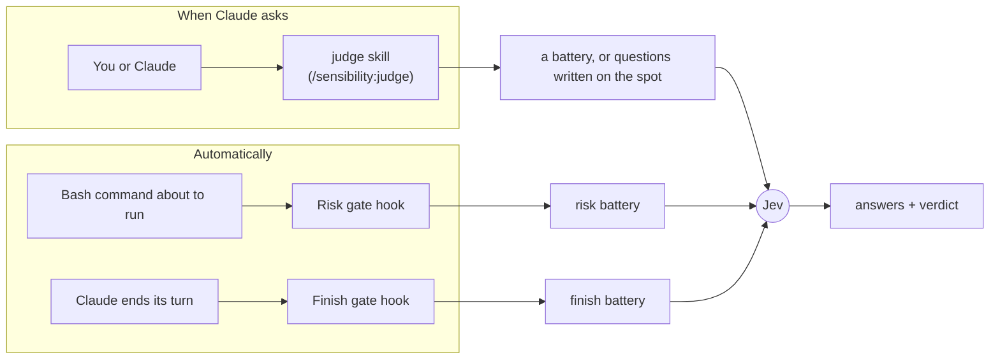
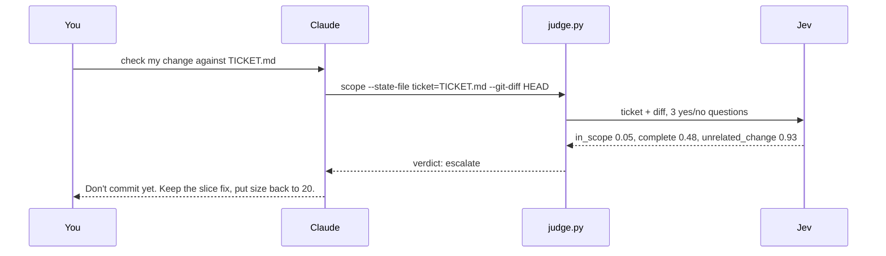

# Sensibility

Sensibility gives Claude Code a second opinion it can ask for in half a second.

Claude makes lots of small calls while it works: does this diff match the ticket, is this commit message honest, is this shell command safe to run, did I actually finish what was asked. Sensibility lets Claude hand those calls to [Jev](https://docs.typesafe.ai), a model from TypeSafe that only answers questions. Jev doesn't write code or text. You give it some text and a few questions, and it returns a probability for each answer in about 0.5 s, for about $0.00005.

## Quick start

**1. Install the plugin.** In Claude Code:

```
/plugin marketplace add rajnandan1/sensibility
/plugin install sensibility@sensibility
```

**2. Add your TypeSafe key.** Get one at https://console.typesafe.ai/keys, then add this line to `~/.zshenv` (or your shell's startup file):

```sh
export TYPESAFE_API_KEY=your-key-here
```

**3. Restart Claude Code** so it picks up the key and the plugin.

**4. Try it.** In any git repo with uncommitted changes, paste this with your own ticket text:

```
Use the sensibility judge to check my uncommitted change against this ticket: <paste the ticket>
```

Claude runs one command and reports a verdict (`act`, `confirm` or `escalate`) with the numbers behind it. If something is off, it tells you what.

**5. Save a check you want to reuse.** A battery is that check: a few questions, saved under a name, so you can run the same one again. You describe the rule. Claude writes the file and tries it on examples before saving.

```
/sensibility:battery make a battery called comment: keep a code comment only if it explains something the code itself can't
```

**6. Use that check.** Next time, ask the judge to run it by name:

```
/sensibility:judge check this comment with the comment battery: # increment the retry counter
```

You also need `python3` 3.9 or later on your PATH. macOS has it after `xcode-select --install`.

## How it works

You only need four words:

- **Jev**: TypeSafe's judging model. It answers questions about some text. It never writes anything.
- **Question**: one thing you ask Jev. There are three kinds. A yes/no question returns the chance the answer is yes (0.93 means very likely). A pick-one question chooses from options you list. A score question places the text on levels you describe.
- **Battery**: a saved set of questions in a JSON file, reused by name. `scope`, for example, asks three questions about a diff and a ticket.
- **Gate**: rules inside a battery that turn Jev's answers into one verdict: `act` (go ahead), `confirm` (flag it, carry on) or `escalate` (stop and show you).

Sensibility uses them in two ways:



**The judge skill** runs when you or Claude ask for it. Every battery you run by hand goes through it, and it can also ask questions Claude writes on the spot.

**The two gates** are hooks. They run on their own, each with its own battery:

| Gate        | Runs when                 | What it does                                                                                                                                                   | Default |
| ----------- | ------------------------- | -------------------------------------------------------------------------------------------------------------------------------------------------------------- | ------- |
| Finish gate | Claude ends a turn        | If Claude stopped short (offered to do the work instead of doing it, asked permission you already gave, ended on a plan), Claude gets one nudge to keep going. | **on**  |
| Risk gate   | Before every Bash command | If a command is risky and destructive, or risky and outside what you asked for, Claude Code stops and asks you first.                                          | **off** |

**The battery skill** (`/sensibility:battery`) turns a rule of yours into a new battery and tests it before saving. See [Batteries](#batteries).

## Things to ask Claude

| You want to                       | Say something like                                                                                                              | What runs                           |
| --------------------------------- | ------------------------------------------------------------------------------------------------------------------------------- | ----------------------------------- |
| Check a change against its ticket | "Use the sensibility judge to check my uncommitted change against TICKET.md"                                                    | `scope` battery                     |
| Check a commit message            | "Use the sensibility judge to check my last commit message against its diff"                                                    | `commit` battery                    |
| Rate a PR or issue description    | "Use the sensibility judge to score how clear this PR description is: ..."                                                      | `clarity` battery                   |
| Pick between options              | "Use the sensibility judge to pick which of these three approaches best fits the ticket"                                        | questions Claude writes on the spot |
| Save a rule as a check            | "/sensibility:battery make a battery called migration: a database migration must be reversible and must not lock a large table" | the battery skill                   |
| See every battery                 | "List the sensibility batteries"                                                                                                | `judge.py --list`                   |

### Example: catching a change the ticket didn't ask for

The ticket says: _page 2 repeats the last item of page 1. Fix the slice. Nothing else is broken._ The diff fixes the slice, but it also changes `total_pages(count, size=20)` to `size=25`.



| Question                                       | Answer     | With `size=20` restored |
| ---------------------------------------------- | ---------- | ----------------------- |
| Is every change something the ticket asks for? | 0.05       | 0.97                    |
| Does the diff do everything the ticket asks?   | 0.48       | 0.96                    |
| Is there an unrelated change?                  | 0.93       | 0.03                    |
| Verdict                                        | `escalate` | `act`                   |

The script read the ticket and ran `git diff` itself, so Claude got the verdict without loading the diff first. The numbers come from a real run; repeat runs moved them by a few hundredths and always gave the same verdict.

## Batteries

A battery is a check you can reuse. It's a small JSON file that holds a few questions for Jev and the rules that turn Jev's answers into a verdict. You write it once, give it a name, and from then on you (or Claude) can run it by that name on any text.

Five batteries come with the plugin:

| Battery   | Checks                                                                | Used by     |
| --------- | --------------------------------------------------------------------- | ----------- |
| `scope`   | does a diff do what its ticket asked, and only that                   | judge skill |
| `commit`  | does a commit message say what changed and why, and match its diff    | judge skill |
| `clarity` | how clearly a PR or issue description reads (scores only, no verdict) | judge skill |
| `risk`    | how irreversible and far-reaching a shell command is                  | Risk gate   |
| `finish`  | whether Claude's last reply stops short of what you asked             | Finish gate |

Your own batteries go in `~/.claude/sensibility/batteries/` (every project) or `.claude/sensibility/batteries/` inside a repo (that repo only).

### Walkthrough: your own battery, start to finish

Say your team keeps shipping database migrations that hurt in production: an index build that locks the `orders` table, a column dropped while old app servers still read it. You want Claude to catch these before they merge. Here's how that goes.

**1. Describe the rule to the battery skill.**

```
/sensibility:battery make a battery called migration: a database migration must be reversible, must not drop or rename a column in the same deploy that stops using it, and must not lock a large table (create indexes concurrently, add columns without a volatile default)
```

**2. Claude builds and tests it.** You don't write any JSON. In our run, the skill:

- wrote three yes/no questions, one per part of the rule: `irreversible`, `drop_in_same_deploy`, `locks_table`;
- expected two inputs: `migration` (the migration file) and `diff` (the app code changes shipping with it);
- made up 9 example migrations (4 safe, 5 unsafe), ran each one twice, and reworded one question after a safe example (`ADD COLUMN ... NOT NULL DEFAULT false`) was wrongly flagged;
- saved the file once all 9 came out right, and pointed out its weakest case: renamed columns score closest to the cutoff.

The result is [`examples/batteries/migration.json`](examples/batteries/migration.json). Claude Code asks you once before the skill writes into `.claude/`.

**3. Use it on a real change.** Your branch adds three migrations and removes `fax` from the `Customer` model:

```sql
-- 0042_add_coupon_code.sql
ALTER TABLE orders ADD COLUMN coupon_code text;

-- 0043_index_orders_created_at.sql
CREATE INDEX orders_created_at_idx ON orders (created_at);

-- 0044_drop_customer_fax.sql
ALTER TABLE customers DROP COLUMN fax;
```

You ask:

```
/sensibility:judge check the new migrations in my uncommitted change with the migration battery
```

Batteries always run through the judge skill. Typing `/sensibility:judge` is the sure way to start it. Plain wording like "check my migrations with the migration battery" works too, since Claude loads the judge skill by itself when you mention a battery; it did in every test run.

Claude runs the battery once per migration. Each run is one command, and the script reads the file and the diff itself:

```
judge.py migration --state-file migration=migrations/0044_drop_customer_fax.sql --git-diff HEAD
```

**4. Read the results.** These are the real answers:

| Migration                      | Irreversible | Drops a column still in use | Locks the table | Verdict    |
| ------------------------------ | ------------ | --------------------------- | --------------- | ---------- |
| `0042_add_coupon_code`         | 0.04         | 0.05                        | 0.09            | `act`      |
| `0043_index_orders_created_at` | 0.03         | 0.06                        | 0.72            | `escalate` |
| `0044_drop_customer_fax`       | 0.06         | 0.74                        | 0.23            | `escalate` |

Claude then checked both flagged files itself and said:

- **0043:** a plain `CREATE INDEX` blocks writes to `orders` until the index is built. Use `CREATE INDEX CONCURRENTLY`, outside a transaction.
- **0044:** `app/models.py` removes `Customer.fax` in the same deploy that drops the column, so old app servers still running during the rollout will hit a missing column. Ship the model change now and move 0044 to the next deploy.
- **0042** is fine.

**5. Make it automatic.** Add one line to your project's `CLAUDE.md`:

```
Before you commit a database migration, run the migration battery on it.
```

From then on, Claude checks every migration it writes without being asked.

### What's inside a battery

Every battery has the same four parts. Here they are for `migration.json`:

| Part          | In `migration.json`                                                                                          | What it's for                                                                                                                                                                      |
| ------------- | ------------------------------------------------------------------------------------------------------------ | ---------------------------------------------------------------------------------------------------------------------------------------------------------------------------------- |
| `description` | "Is a database migration reversible, deploy-safe for dropped/renamed columns, and free of large table locks" | One line shown when you list batteries.                                                                                                                                            |
| `state`       | two keys: `migration` and `diff`                                                                             | What text the battery expects. A key named `diff` can be filled straight from git with `--git-diff`.                                                                               |
| `questions`   | three yes/no questions: `irreversible`, `drop_in_same_deploy`, `locks_table`                                 | What Jev is asked. Each one spells out what counts as yes and what counts as no, including the tricky cases: a constant default like `false` doesn't lock the table, `now()` does. |
| `gate`        | any score of 0.6 or more: `escalate`. Any of 0.5 or more: `confirm`. Otherwise: `act`.                       | Turns the scores into one verdict. Rules are checked in order and the first match wins.                                                                                            |

<details>
<summary>Show the full <code>migration.json</code></summary>

```json
{
    "description": "Is a database migration reversible, deploy-safe for dropped/renamed columns, and free of large table locks",
    "state": {
        "description": "`migration`: the full migration file, up and down. `diff`: the application code changes shipping in the same deploy (may be empty).",
        "keys": ["migration", "diff"]
    },
    "questions": {
        "irreversible": {
            "type": "noul",
            "instructions": "Is the `migration` irreversible, meaning there is no down/rollback step that actually undoes what the up step does?",
            "criteria": {
                "true": "No down step, a down step that is empty, `pass`, or raises IrreversibleMigration, or a down step that does not undo the up step (for example the up adds an index and the down does nothing about it).",
                "false": "A down step exists and undoes every change of the up step: drops what was created, re-creates what was dropped, renames back what was renamed. Data lost by a drop does not count as irreversible if the schema is restored."
            }
        },
        "drop_in_same_deploy": {
            "type": "noul",
            "instructions": "Does the `migration` drop or rename a column while `diff`, shipping in the same deploy, is the change that stops the application from using that column?",
            "criteria": {
                "true": "The migration drops or renames a column, and `diff` removes, or switches to the new name, any of the reads/writes, model field, or queries of that same column. Old app instances still running during the deploy would break.",
                "false": "The migration drops or renames no column; or it drops a column that `diff` does not touch because the app stopped using it in an earlier deploy; or it only adds columns, tables, or indexes."
            }
        },
        "locks_table": {
            "type": "noul",
            "instructions": "Does the up step of `migration` take a long, blocking lock on a table that may be large?",
            "criteria": {
                "true": "Creates an index without CONCURRENTLY (or the framework's concurrent option); adds a column with a volatile default such as now(), random(), gen_random_uuid(), or clock_timestamp(); changes a column type forcing a rewrite; adds a NOT NULL or foreign key constraint without NOT VALID then a separate validate; or runs a backfill UPDATE of the whole table inside the migration.",
                "false": "Creates indexes CONCURRENTLY; adds a nullable column; adds a column with a constant default such as false, 0, or 'pending', even with NOT NULL, because Postgres 11+ stores that without rewriting the table; drops or renames a column; adds a constraint as NOT VALID; or only touches a table the migration itself just created."
            }
        }
    },
    "gate": {
        "rules": [
            {
                "verdict": "escalate",
                "any": [
                    "irreversible.noul >= 0.6",
                    "drop_in_same_deploy.noul >= 0.6",
                    "locks_table.noul >= 0.6"
                ]
            },
            {
                "verdict": "confirm",
                "any": [
                    "irreversible.noul >= 0.5",
                    "drop_in_same_deploy.noul >= 0.5",
                    "locks_table.noul >= 0.5"
                ]
            }
        ],
        "default": "act"
    }
}
```

</details>

### Making your own

The walkthrough above is the whole process: describe the rule after `/sensibility:battery`, give it a name, and say whether it's for this repo or all your projects. The skill tests the battery on examples before it saves it. If you have real examples of good and bad cases, paste them in; the skill tests against those instead of making up its own.

To change a battery later, edit its JSON or ask Claude ("make the migration battery also flag `ALTER COLUMN ... TYPE`"). The skill retests it the same way.

Jev can't count or do arithmetic, so leave rules like "at most 3 lines" or "under 72 characters" to code or to Claude.

### Making a battery run without asking

Claude only runs a battery when something tells it to. You have three options, from least to most automatic:

1. **Ask each time:** `/sensibility:judge check this with the migration battery`.
2. **Add a line to your `CLAUDE.md`:** _"Before you commit a database migration, run the migration battery on it."_ Claude then does it at that point on its own. This is enough for most rules.
3. **Write a hook** that calls `judge.py` on every matching event. Only worth it for a check that must never be skipped, since each run adds about 0.5 s.

### Changing a built-in

Copy its file from [`batteries/`](batteries/) into `~/.claude/sensibility/batteries/` and edit the copy. A copy in a project folder wins over your user copy, and both win over the plugin's own. The two gate batteries, `risk` and `finish`, only load from your user folder or the plugin, so a repo you clone can't change how your gates behave.

### More example batteries

<details>
<summary><code>comment.json</code>: keep a code comment only if it explains something the code can't</summary>

This battery asks one pick-one question, "what kind of comment is this?", and passes only the kinds worth keeping. [View the file](examples/batteries/comment.json).

| Comment                                                                               | Jev's pick         | Verdict    |
| ------------------------------------------------------------------------------------- | ------------------ | ---------- |
| `# increment the retry counter`                                                       | narration          | `escalate` |
| `# changed from 3 to 5 after the outage last week`                                    | history            | `escalate` |
| `# IMPORTANT: do not remove, this is fine for now`                                    | justification      | `escalate` |
| `# Safari drops Content-Length on 304 replies, so read the size from the cached copy` | outside_constraint | `act`      |
| `# RFC 9110 section 15.4.5: a 304 response has no body`                               | spec_link          | `act`      |
| `// eslint-disable-next-line no-console`                                              | suppression        | `act`      |

</details>

<details>
<summary><code>pr-description.json</code>: plain prose that says what was broken and why the change fixes it</summary>

This battery asks three yes/no questions: does it use template headers, does it use buzzwords, does it explain why. [View the file](examples/batteries/pr-description.json).

| PR description                                                                                                                 | Template headers | Buzzwords | Explains why | Verdict    |
| ------------------------------------------------------------------------------------------------------------------------------ | ---------------- | --------- | ------------ | ---------- |
| `## Summary` / "introduces a robust enhancement" / `## Changes` / `## Testing`                                                 | 0.98             | 0.95      | 0.05         | `escalate` |
| "Updated jev.py to check the body of 403 responses. Added a blocked error."                                                    | 0.08             | 0.03      | 0.15         | `escalate` |
| "ok so the judge script treated every HTTP 403 as a missing key. Turns out the firewall also sends a 403 for some shell text…" | 0.04             | 0.03      | 0.89         | `act`      |

</details>

<details>
<summary><code>log-line.json</code>: a failure log must name the operation and the record, and never leak secrets or personal data</summary>

Four yes/no questions: names the operation, names the record, leaks a secret, leaks personal data. [View the file](examples/batteries/log-line.json).

| Log call                              | Operation | Record | Secret | Personal data | Verdict    |
| ------------------------------------- | --------- | ------ | ------ | ------------- | ---------- |
| `charge card failed for order_id=%s`  | 0.99      | 0.98   | 0.04   | 0.04          | `act`      |
| `payment failed for {customer.email}` | 0.29      | 0.37   | 0.03   | 0.99          | `escalate` |
| `something went wrong`                | 0.02      | 0.02   | 0.02   | 0.02          | `confirm`  |

</details>

All scores in this section come from real runs.

## Turn the gates on or off

From a terminal:

```sh
claude plugin install sensibility@sensibility --config bash_gate=true    # Risk gate on
claude plugin install sensibility@sensibility --config stop_gate=false   # Finish gate off
```

Use `=true` or `=false` with either name. The command works even when the plugin is already installed. Run `/reload-plugins` or restart Claude Code afterwards.

You can also run `/plugin configure sensibility@sensibility` inside Claude Code, type `true` or `false` in each field, and choose Save configuration.

## FAQ

<details>
<summary><b>How do I see my current settings?</b></summary>

Look for `sensibility@sensibility` under `pluginConfigs` in `~/.claude/settings.json`. If it isn't there, you're on the defaults: Finish gate on, Risk gate off. `claude plugin details sensibility@sensibility` lists what the plugin installs.

</details>

<details>
<summary><b>Do the gates use batteries?</b></summary>

Yes. The Risk gate uses the `risk` battery and the Finish gate uses `finish`. To change what a gate asks or when it steps in, copy its battery into `~/.claude/sensibility/batteries/` and edit it. Gate batteries never load from a project folder, so a repo you clone can't loosen your gates.

</details>

<details>
<summary><b>If batteries decide what a gate does, why are there on/off options?</b></summary>

A battery decides how a gate judges. The option decides whether it runs at all. When a gate is off, its hook exits straight away: no call to Jev, no delay, nothing sent to TypeSafe. A battery that always says `act` would still call Jev on every event.

</details>

<details>
<summary><b>How do I run a battery? Do I need to type <code>/sensibility:judge</code>?</b></summary>

Batteries run through the judge skill. The sure way is `/sensibility:judge check this with the migration battery`. Plain wording like "check this with the migration battery" also works, because Claude loads the judge skill itself when you mention a battery. You never call a battery directly, and it doesn't have a command of its own.

</details>

<details>
<summary><b>I made a battery. Does it need a hook?</b></summary>

No. The judge skill runs any battery by name. Claude doesn't know yours exists until you mention it or it runs `--list`, so name it in your request or add it to your `CLAUDE.md`. Write your own hook only when the check must run on every event, and remember that each check adds about 0.5 s.

</details>

<details>
<summary><b>Can Sensibility pick the right skill or tool for Claude?</b></summary>

Not today. Someone built this as a Jev hook ([`shimo4228/jev-skill-router`](https://github.com/shimo4228/jev-skill-router)). The author concluded it doesn't help a strong model, because Claude already sees every skill's description. It also cost 10k to 25k tokens and up to 1.6 s on every prompt.

</details>

<details>
<summary><b>Do I still need TypeSafe's `typesafe-ai` skill?</b></summary>

Only if you're writing an app that calls Jev from its own code. That skill teaches TypeSafe's SDKs. Sensibility is for Claude calling Jev while it works, and it doesn't use that skill.

</details>

<details>
<summary><b>How much does it cost, and how slow is it?</b></summary>

One judgment (several questions answered together) takes about 0.5 s and costs about $0.00005. With the Risk gate on, 50 Bash commands cost about $0.003 in total. The plugin adds about 189 tokens to each Claude session.

</details>

<details>
<summary><b>What happens if my key is missing or Jev is down?</b></summary>

The judge skill prints the setup steps and stops. The gates switch themselves off and show one message per session. Neither gate ever blocks your work because of a missing key, a network error or a slow answer.

</details>

<details>
<summary><b>A check came back `blocked`. Why?</b></summary>

TypeSafe's web firewall rejects some shell text, such as curl flags or paths like `/etc/passwd`. In testing that was 4 of 164 real commands. Claude rewords the text and tries once more. The gates let the command through.

</details>

<details>
<summary><b>Why do the numbers change a little between runs?</b></summary>

Jev's answers wander by a few hundredths between identical calls. The built-in thresholds are set away from where real answers cluster, so the verdict stays the same.

</details>

<details>
<summary><b>Why is the Finish gate on and the Risk gate off?</b></summary>

The Finish gate costs nothing unless it fires. In testing on 51 real turns, the Finish gate fired 3 times and was right about once; each wrong nudge costs one extra Claude turn. The Risk gate adds about 0.5 s to every Bash command, so it's opt-in. It stops force pushes, `DROP TABLE` and `rm -rf ~`. On 100 real Bash commands its current rules asked once, down from 7 with the first version; the 6 it no longer asks about were `gh` writes the user had requested.

</details>

<details>
<summary><b>What leaves my machine, and what's logged?</b></summary>

For each gate judgment, your last prompt plus the command or reply being judged goes to TypeSafe's API. Each gate judgment is also appended to `judgments.jsonl` under `~/.claude/plugins/data/` (you can delete it any time). Judge skill calls aren't logged. If your prompts or commands must stay on your machine, turn both gates off.

</details>

## License

MIT. See [LICENSE](LICENSE).
