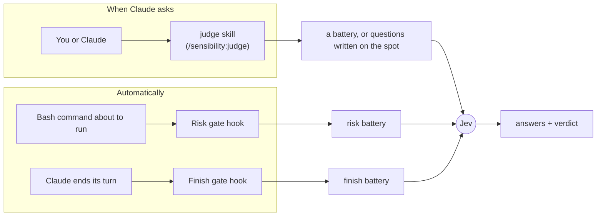
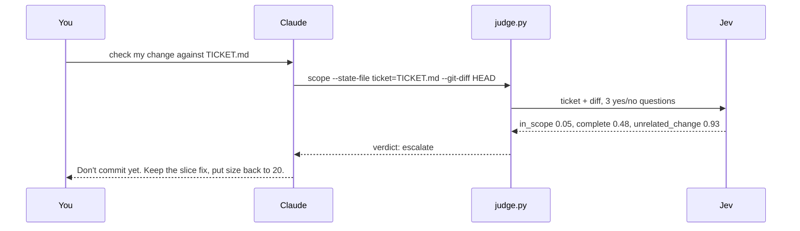

# Sensibility

Sensibility gives Claude Code a second opinion it can ask for in half a second.

Claude makes lots of small calls while it works: does this diff match the ticket, is this commit message honest, is this shell command safe to run, did I actually finish what was asked. Sensibility lets Claude hand those calls to [Jev](https://docs.typesafe.ai), a model from TypeSafe that only answers questions. Jev doesn't write code or text. You give it some text and a few questions, and it returns a probability for each answer in about 0.5 s, for about $0.00005.

## Quick start

**1. Install the plugin.** In Claude Code:

```
/plugin marketplace add rajnandan1/sensibility
/plugin install sensibility@sensibility
```

**2. Add your TypeSafe key.** Get one at https://console.typesafe.ai/keys, then add this line to `~/.zshenv` (or your shell's startup file):

```sh
export TYPESAFE_API_KEY=your-key-here
```

**3. Restart Claude Code** so it picks up the key and the plugin.

**4. Try it.** In any git repo with uncommitted changes, paste this with your own ticket text:

```
Use the sensibility judge to check my uncommitted change against this ticket: <paste the ticket>
```

Claude runs one command and reports a verdict (`act`, `confirm` or `escalate`) with the numbers behind it. If something is off, it tells you what.

**5. Save a check you want to reuse.** A battery is that check: a few questions in a JSON file, run again by name. You describe the rule. Claude writes the file and tries it on examples before saving.

```
Use the sensibility judge to save a battery called comment: keep a code comment only if it explains something the code itself can't
```

**6. Use that check.** Next time, ask the judge to run it by name:

```
/sensibility:judge check this comment with the comment battery: # increment the retry counter
```

You also need `python3` 3.9 or later on your PATH. macOS has it after `xcode-select --install`.

## How it works

You only need four words:

- **Jev**: TypeSafe's judging model. It answers questions about some text. It never writes anything.
- **Question**: one thing you ask Jev. There are three kinds. A yes/no question returns the chance the answer is yes (0.93 means very likely). A pick-one question chooses from options you list. A score question places the text on levels you describe.
- **Battery**: a saved set of questions in a JSON file, reused by name. `scope`, for example, asks three questions about a diff and a ticket.
- **Gate**: rules inside a battery that turn Jev's answers into one verdict: `act` (go ahead), `confirm` (flag it, carry on) or `escalate` (stop and show you).

Sensibility uses them in two ways:



**The judge skill** runs when you or Claude ask for it. Every battery you run by hand goes through it, and it can also ask questions Claude writes on the spot.

**The two gates** are hooks. They run on their own, each with its own battery:

| Gate        | Runs when                 | What it does                                                                                                                                                   | Default |
| ----------- | ------------------------- | -------------------------------------------------------------------------------------------------------------------------------------------------------------- | ------- |
| Finish gate | Claude ends a turn        | If Claude stopped short (offered to do the work instead of doing it, asked permission you already gave, ended on a plan), Claude gets one nudge to keep going. | **off** |
| Risk gate   | Before every Bash command | If a command is risky and destructive, or risky and outside what you asked for, Claude Code stops and asks you first.                                          | **off** |

To save a check of your own as a battery, see [Batteries](#batteries).

## Things to ask Claude

| You want to                       | Say something like                                                                                                              | What runs                           |
| --------------------------------- | ------------------------------------------------------------------------------------------------------------------------------- | ----------------------------------- |
| Check a change against its ticket | "Use the sensibility judge to check my uncommitted change against TICKET.md"                                                    | `scope` battery                     |
| Check a commit message            | "Use the sensibility judge to check my last commit message against its diff"                                                    | `commit` battery                    |
| Rate a PR or issue description    | "Use the sensibility judge to score how clear this PR description is: ..."                                                      | `clarity` battery                   |
| Pick between options              | "Use the sensibility judge to pick which of these three approaches best fits the ticket"                                        | questions Claude writes on the spot |
| Save a rule as a check            | "Use the sensibility judge to save a battery called migration: a database migration must be reversible and must not lock a large table" | Claude writes the JSON, then `judge.py migration` |
| See every battery                 | "List the sensibility batteries"                                                                                                | `judge.py --list`                   |

### Example: catching a change the ticket didn't ask for

The ticket says: _page 2 repeats the last item of page 1. Fix the slice. Nothing else is broken._ The diff fixes the slice, but it also changes `total_pages(count, size=20)` to `size=25`.



| Question                                       | Answer     | With `size=20` restored |
| ---------------------------------------------- | ---------- | ----------------------- |
| Is every change something the ticket asks for? | 0.05       | 0.97                    |
| Does the diff do everything the ticket asks?   | 0.48       | 0.96                    |
| Is there an unrelated change?                  | 0.93       | 0.03                    |
| Verdict                                        | `escalate` | `act`                   |

The script read the ticket and ran `git diff` itself, so Claude got the verdict without loading the diff first. The numbers come from a real run; repeat runs moved them by a few hundredths and always gave the same verdict.

## Batteries

A battery is a check you can reuse: a small JSON file holding a few questions for Jev and the rules that turn the answers into a verdict. It has a name, and you or Claude run it by that name on any text. The wording is pinned, so the same input gets the same verdict every time. Questions written on the spot don't give you that: one diff and its ticket got `act`, `confirm` and `escalate` from three reasonable phrasings of the same three questions.

Five batteries come with the plugin:

| Battery   | Checks                                                                | Used by     |
| --------- | --------------------------------------------------------------------- | ----------- |
| `scope`   | does a diff do what its ticket asked, and only that                   | judge skill |
| `commit`  | does a commit message say what changed and why, and match its diff    | judge skill |
| `clarity` | how clearly a PR or issue description reads (scores only, no verdict) | judge skill |
| `risk`    | how irreversible and far-reaching a shell command is                  | Risk gate   |
| `finish`  | whether Claude's last reply stops short of what you asked             | Finish gate |

Your own go in `~/.claude/sensibility/batteries/` (every project) or `.claude/sensibility/batteries/` inside a repo (that repo only). To change a built-in, copy its file from [`batteries/`](batteries/) into one of those folders and edit the copy. The two gate batteries, `risk` and `finish`, only load from your user folder or the plugin, so a repo you clone can't change how your gates behave.

### Example: keep a code comment only if it explains something the code can't

Ask Claude for it:

```
Use the sensibility judge to save a battery called comment: keep a code comment only if it explains something the code itself can't
```

Claude writes the file, tries it on a few comments that should pass and a few that should fail, and saves it once they all come out right. This is what it wrote: one pick-one question, "what kind of comment is this?", and a gate that passes only the kinds worth keeping.

<details>
<summary>Show <code>comment.json</code></summary>

```json
{
  "description": "Does a code comment earn its place, or should it go",
  "state": {
    "description": "`comment`: the comment text. `code`: the lines it sits above.",
    "keys": ["comment", "code"]
  },
  "questions": {
    "kind": {
      "type": "choice",
      "instructions": "What kind of comment is `comment`, given the `code` it sits above?",
      "criteria": {
        "outside_constraint": "Explains behaviour forced by something outside this codebase: a vendor or library bug, a platform or browser quirk, a protocol.",
        "spec_link": "Links an issue, RFC, or spec that carries a constraint.",
        "api_contract": "A doc comment defining a public API's contract.",
        "suppression": "A lint or type-checker suppression.",
        "license": "A license or legal header.",
        "narration": "Restates what the code does.",
        "history": "Describes past changes, who changed it, or when.",
        "justification": "Defends the code: important, do not remove, fine for now, too risky.",
        "todo": "A TODO or FIXME.",
        "other": "None of the above."
      }
    }
  },
  "gate": {
    "rules": [
      { "verdict": "act", "any": ["kind.choice == outside_constraint", "kind.choice == spec_link", "kind.choice == api_contract", "kind.choice == suppression", "kind.choice == license"] },
      { "verdict": "confirm", "any": ["kind.choice == other", "kind.confidence < 0.5"] }
    ],
    "default": "escalate"
  }
}
```

</details>

Run it by name:

```
/sensibility:judge check this comment with the comment battery: # increment the retry counter
```

Real answers:

| Comment                                                                               | Jev's pick         | Verdict    |
| ------------------------------------------------------------------------------------- | ------------------ | ---------- |
| `# increment the retry counter`                                                       | narration          | `escalate` |
| `# changed from 3 to 5 after the outage last week`                                    | history            | `escalate` |
| `# IMPORTANT: do not remove, this is fine for now`                                    | justification      | `escalate` |
| `# Safari drops Content-Length on 304 replies, so read the size from the cached copy` | outside_constraint | `act`      |
| `# RFC 9110 section 15.4.5: a 304 response has no body`                               | spec_link          | `act`      |
| `// eslint-disable-next-line no-console`                                              | suppression        | `act`      |

To make it run without asking, add one line to your `CLAUDE.md`: _"Before you commit, run the comment battery on every comment the change adds."_ Jev can't count or do arithmetic, so leave rules like "under 72 characters" to code or to Claude. The file format is in the judge skill's [reference](skills/judge/reference.md).

## Turn the gates on or off

From a terminal:

```sh
claude plugin install sensibility@sensibility --config bash_gate=true    # Risk gate on
claude plugin install sensibility@sensibility --config stop_gate=true    # Finish gate on
```

Use `=true` or `=false` with either name. The command works even when the plugin is already installed. Run `/reload-plugins` or restart Claude Code afterwards.

You can also run `/plugin configure sensibility@sensibility` inside Claude Code, type `true` or `false` in each field, and choose Save configuration.

## FAQ

<details>
<summary><b>How do I see my current settings?</b></summary>

Look for `sensibility@sensibility` under `pluginConfigs` in `~/.claude/settings.json`. If it isn't there, you're on the defaults: both gates off. `claude plugin details sensibility@sensibility` lists what the plugin installs.

</details>

<details>
<summary><b>Do the gates use batteries?</b></summary>

Yes. The Risk gate uses the `risk` battery and the Finish gate uses `finish`. To change what a gate asks or when it steps in, copy its battery into `~/.claude/sensibility/batteries/` and edit it. Gate batteries never load from a project folder, so a repo you clone can't loosen your gates.

</details>

<details>
<summary><b>If batteries decide what a gate does, why are there on/off options?</b></summary>

A battery decides how a gate judges. The option decides whether it runs at all. When a gate is off, its hook exits straight away: no call to Jev, no delay, nothing sent to TypeSafe. A battery that always says `act` would still call Jev on every event.

</details>

<details>
<summary><b>How do I run a battery? Do I need to type <code>/sensibility:judge</code>?</b></summary>

Batteries run through the judge skill. The sure way is `/sensibility:judge check this with the comment battery`. Plain wording like "check this with the comment battery" also works, because Claude loads the judge skill itself when you mention a battery. You never call a battery directly, and it doesn't have a command of its own.

</details>

<details>
<summary><b>I made a battery. Does it need a hook?</b></summary>

No. The judge skill runs any battery by name. Claude doesn't know yours exists until you mention it or it runs `--list`, so name it in your request or add it to your `CLAUDE.md`. Write your own hook only when the check must run on every event, and remember that each check adds about 0.5 s.

</details>

<details>
<summary><b>Can Sensibility pick the right skill or tool for Claude?</b></summary>

Not today. Someone built this as a Jev hook ([`shimo4228/jev-skill-router`](https://github.com/shimo4228/jev-skill-router)). The author concluded it doesn't help a strong model, because Claude already sees every skill's description. It also cost 10k to 25k tokens and up to 1.6 s on every prompt.

</details>

<details>
<summary><b>Do I still need TypeSafe's `typesafe-ai` skill?</b></summary>

Only if you're writing an app that calls Jev from its own code. That skill teaches TypeSafe's SDKs. Sensibility is for Claude calling Jev while it works, and it doesn't use that skill.

</details>

<details>
<summary><b>How much does it cost, and how slow is it?</b></summary>

One judgment (several questions answered together) takes about 0.5 s and costs about $0.00005. With the Risk gate on, 50 Bash commands cost about $0.003 in total. The plugin adds about 100 tokens to each Claude session.

</details>

<details>
<summary><b>What happens if my key is missing or Jev is down?</b></summary>

The judge skill prints the setup steps and stops. The gates switch themselves off and show one message per session. Neither gate ever blocks your work because of a missing key, a network error or a slow answer.

</details>

<details>
<summary><b>A check came back `blocked`. Why?</b></summary>

TypeSafe's web firewall rejects some shell text, such as curl flags or paths like `/etc/passwd`. In testing that was 4 of 164 real commands. Claude rewords the text and tries once more. The gates let the command through.

</details>

<details>
<summary><b>Why do the numbers change a little between runs?</b></summary>

Jev's answers wander by a few hundredths between identical calls. The built-in thresholds are set away from where real answers cluster, so the verdict stays the same.

</details>

<details>
<summary><b>Why are both gates off by default?</b></summary>

Each gate calls Jev on every event it watches, so each adds about 0.5 s there: the Risk gate to every Bash command, the Finish gate to the end of every turn. In testing on 51 real turns, the Finish gate fired 3 times and was right about once; each wrong nudge costs one extra Claude turn. The Risk gate stops force pushes, `DROP TABLE` and `rm -rf ~`. On 100 real Bash commands its current rules asked once, down from 7 with the first version; the 6 it no longer asks about were `gh` writes the user had requested.

</details>

<details>
<summary><b>What leaves my machine, and what's logged?</b></summary>

For each gate judgment, your last prompt plus the command or reply being judged goes to TypeSafe's API. Each gate judgment is also appended to `judgments.jsonl` under `~/.claude/plugins/data/` (you can delete it any time). Judge skill calls aren't logged. If your prompts or commands must stay on your machine, turn both gates off.

</details>

## License

MIT. See [LICENSE](LICENSE).
